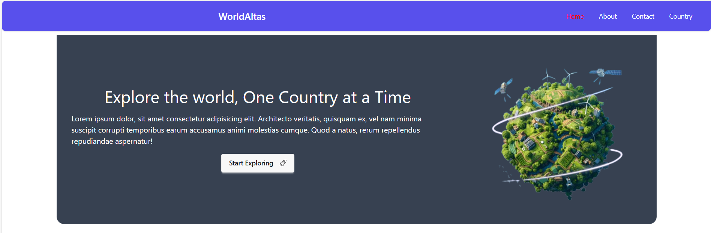
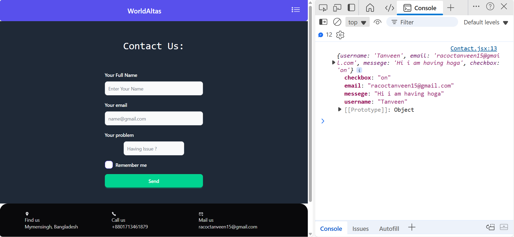
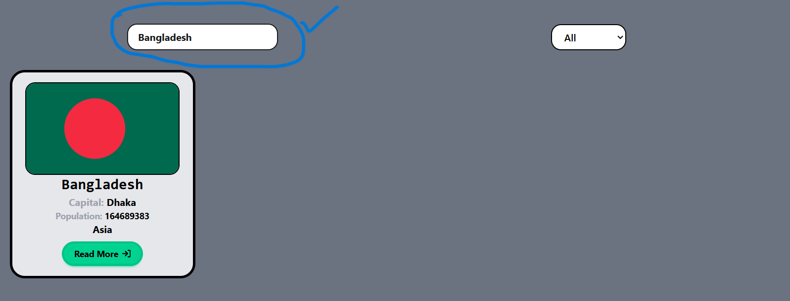

<html>
<head>
<tittle><h1>These are the previews of my website</h1></tittle>
</head>
<body>
<h3>Home page with navigation bar :</h3>
 
<h3>This is the footer</h3>
 
 
 
 
 
 
 
 
 

</body>
</html>