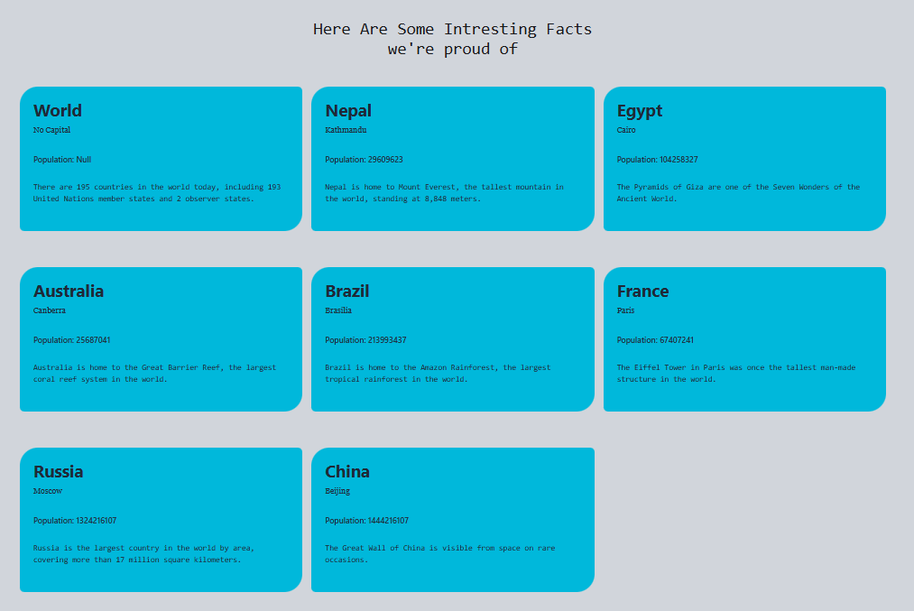
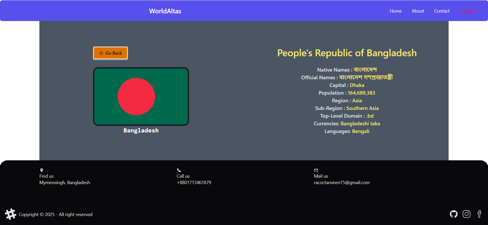

<html>
<head>
<tittle><h1>These are the previews of my website</h1></tittle>
</head>
<body>
<h3>Home page with navigation bar :</h3>
 
<h3>This is the footer :</h3>
 
<h3>About Page :</h3>
 
<h3>Contact Page :</h3>
 
<h3>Contact page with working console </h3>
 
<h3>Country Page :</h3>
 
<h3>Country Card / Details Page :</h3>
 
<h3>Select Function :</h3>
 
<h3>Searching :</h3>
 
<h3>Error Page :</h3>
 

</body>
</html>